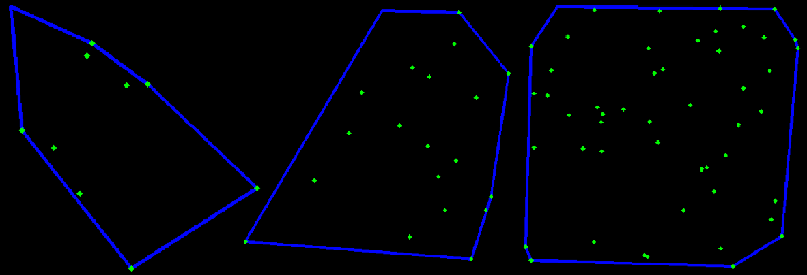

# Convex Hull
```
This project is trying to implement convex hull by using Graham's Scan Algorithm.
```

### Convex Hull
Given a group of points, the set of convex hull is the smallest convex polygon that contain all the points. The example and the result of the program show as below:
```
File name: convex_hull_implementation.py
Command line: python convex_hull_implementation.py 
```

```
NOTE: 
  - the green dots are random points and the blue line is the "convex hull" of the points
  - the corner with no green dot is the start points, because for image the origin of coordinates 
    is on the top-left. Is the same as to find the bottommost + leftmost in the Coordinate System.
```
### Graham's Scan Algorithm
```
Time Complexity: O(nlogn)
```
The process demo of Graham's scann show as below [(from Wikipedia)](https://en.wikipedia.org/wiki/Graham_scan)


#### Part 1: sort the points
(a) Find the start points: This project find the (smallest x, smallest y) as start points.

(b) Sort the points: This project calculate angle(theta) to sort the points, if points have same angle use distance to sort.
```
NOTE: any sorting algorithm can apply to this part, this project using merge sort. 
      * time complexity O(nlogn)
```
#### Part 2: Algorithm to consider the point in convex set or not


## Code
- [Image Contours](https://github.com/Hank-Tsou/Computer-Vision-OpenCV-Python/tree/master/tutorials/Image_Processing/8_Image_Contours)
- [Convex Hull Implementation](https://github.com/Hank-Tsou/Convex-Hull)

## License

This project is licensed under the MIT License - see the [LICENSE.md](LICENSE.md) file for details

## Acknowledgments

* Author: Hank Tsou
* Contact: hank630280888@gmail.com
